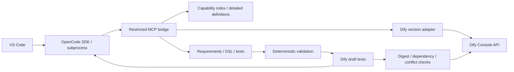

# Architecture and extension interfaces

[English](architecture.md) · [简体中文](architecture.zh-CN.md)

VS Code owns project files, credentials, and task lifecycle. OpenCode owns model calls, context, and tool execution. The host enforces frozen tests, budgets, and publication conditions rather than implementing a second general-purpose planner.

## Modules

| Path                                   | Responsibility                                                                                       |
| -------------------------------------- | ---------------------------------------------------------------------------------------------------- |
| `src/extension.ts`, `src/ui/`          | Settings, chat, input validation, commands, and change confirmation                                  |
| `src/engine/opencode.ts`               | Pinned CLI/SDK, isolated server, streamed events, session recovery, and cancellation                 |
| `src/engine/bridge.ts`                 | Loopback-only MCP, random bearer authentication, rejected browser origins, and restricted operations |
| `src/dify/transport.ts`                | Cookies, CSRF, session persistence, one refresh after a 401, and reverse-proxy paths                 |
| `src/dify/capabilities.ts`             | Tool identities, allowlisted parameters, pagination, status, and detailed discovery                  |
| `src/dify/client.ts`, `sse.ts`         | Console imports/exports, draft runs, SSE parsing, cancellation, and publication                      |
| `src/core/controller.ts`               | Frozen tests, persisted write intent, repair limits, digest gates, and promotion conflict checks     |
| `src/core/validation.ts`               | YAML, graph, references, parameters, nested JSON Schema validation, and dependencies                 |
| `src/core/node-templates.ts`           | Node structures derived from pinned upstream code; templates do not certify compatibility            |
| `src/core/project.ts`, `types.ts`      | Shared project files, private storage, and data contracts                                            |
| `src/core/i18n.ts`, `src/ui/locale.ts` | English/Chinese interface messages and locale selection                                              |

## Settings and chat

Settings open in a single editor tab. Chat uses a bottom composer and conversation timeline with requirements, agent replies, tool calls, task phases, and results. Its default container is the Secondary Side Bar (`aladdinDifyRight`, view `aladdinDify.taskPanel`). These IDs avoid old left-sidebar layout caches. A status-bar shortcut and commands reopen the panel. Automatic startup display can be disabled in Settings. Secondary-side-bar placement uses the [stable VS Code 1.106 contribution API](https://code.visualstudio.com/updates/v1_106#_view-containers-in-secondary-side-bar).

Webviews communicate through a fixed command allowlist. The host validates messages with Zod and performs network calls; browser scripts do not hold Dify clients. A nonce CSP and local resource roots limit loaded content. Responses include public configuration and credential-presence flags, never passwords, cookies, API keys, or secret references. Password/key form drafts stay in page memory. Changing provider or URL does not reuse a key from another connection.

The interface follows the VS Code language by default, with English and Simplified Chinese overrides. Changing it rebuilds both webviews and clears unsaved password/key inputs. User messages, agent responses, project names, tool definitions, and external errors keep their original language. Command-palette localization follows the VS Code display language.

Settings work without an open folder. Starting a task initializes the project and writes requirements and acceptance criteria to `dify.project.json` and `requirements.md`; users do not need to edit Markdown to get started.

`sendChat` uses the existing task controller. The first message starts a task; follow-ups continue the same OpenCode session and test application. `ChatJournal` merges streamed events and final replies by session/part ID, filters internal user prompts and reasoning, and keeps limited tool metadata. The current conversation is saved atomically in private extension storage. New conversations archive previous records without deleting project files. Follow-ups retain the frozen baseline and target, reset repair rounds, and retain accumulated token usage. A webview reports readiness only after DOM initialization.

## Authentication and versions

Adapters target Dify 1.14.2 / DSL 0.6.0 and Dify 1.17.1 / DSL 0.7.0. Other versions need their own adapter and tests. A `ConnectionProfile` contains no plaintext password. Both pinned versions encode UTF-8 passwords as Base64 according to their upstream login implementation; Base64 is not encryption. HTTPS provides transport protection. Console authentication uses cookies and `X-CSRF-Token`, not the application Service API key.

A 401 permits one refresh. Network errors do not automatically replay writes. Import, publication, and promotion intent is persisted before requests. Recovery checks remote state; ambiguous outcomes require attention. An ambiguous original-app update is not replayed. Draft updates submit the server hash so the server can reject a change occurring after the client's last conflict check.

Dify 1.14.2 requires the complete `environment_variables` list. Existing secrets use their original IDs and the upstream 20-asterisk mask, allowing the server to preserve their values. Dify 1.17.1 uses `environment_variable_patch` without secret values. Both submit the remote hash.

## Capability visibility

The index covers built-in/plugin, custom API, workflow, and MCP tools visible in the selected workspace. Identity is `[kind, providerId, toolName]`; display names are not keys. Detailed definitions retain required/default values, enums, form types, nested JSON schemas, output schemas, and plugin references. Unknown output remains unknown. Missing dynamic options cannot be guessed.

Credential fields are excluded through allowlists. Tool descriptions are external data, not plugin policy. MCP does not expose arbitrary shell commands, arbitrary file access, or direct original-app overwrites. A changed capability digest invalidates previous test evidence even if YAML still passes validation.

## Tests and recovery

The host freezes the test digest after the agent's first candidate and test suite. Failures return real nodes, outputs, and assertions to the same engine session. Defaults allow an initial generation and at most five repairs. An unchanged candidate and repeated error across two rounds stop the loop.

Each Workflow case runs independently. Each Chatflow case gets its own conversation, restarted after a repair. The final turn must satisfy case-level assertions. SSE requires `workflow_finished`; successful Chatflow runs also require `message_end`. HTTP 200, a successful import, or valid YAML alone does not establish business correctness. Model-based semantic scoring is not implemented.

Tests can write to external systems. A test application isolates the Dify definition, not business data. Unknown business writes cannot be assumed idempotent. Use the tool's test environment, idempotency keys, or manual reconciliation before resuming. This Beta has no cross-system transaction rollback.

## Limits

Static validation cannot cover every runtime rule; real import and execution remain required. Node templates have not all passed live per-node tests. Exported secret environment-variable values are unavailable and must be configured separately in test copies. Original-app updates preserve existing values; unsupported secret-node merges block promotion. Missing credentials require user action, not DSL repairs. OpenCode/Dify upgrades require renewed adapter, native-engine, and business acceptance tests.
