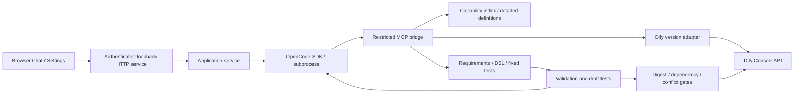

# Architecture

[English](architecture.md) | [简体中文](architecture.zh-CN.md)

The local Node.js service owns files, credentials, and task lifecycle. OpenCode owns model calls, context, and tool execution. The application enforces frozen tests, budgets, and publication conditions rather than implementing another general-purpose planner.

## Modules

| Path                                          | Responsibility                                                                             |
| --------------------------------------------- | ------------------------------------------------------------------------------------------ |
| `src/web/cli.ts`, `runtime.ts`                | CLI arguments, browser launch, signal cleanup, native runtime discovery                    |
| `src/web/server.ts`, `page.ts`, `browser.ts`  | Authenticated HTTP/SSE, browser transport, folder selection, file reviews, confirmations   |
| `src/app/service.ts`, `host.ts`               | Connection profiles, capability synchronization, conversation continuation, task execution |
| `src/app/storage.ts`                          | Atomic private JSON and native OS credential storage                                       |
| `src/ui/`                                     | Chat timeline, Settings forms, input validation, fixed command allowlist                   |
| `src/engine/opencode.ts`                      | CLI/SDK 1.18.34, isolated server, streamed events, session recovery, cancellation          |
| `src/engine/bridge.ts`                        | Loopback-only MCP, random bearer token, rejected browser origins, restricted operations    |
| `src/dify/transport.ts`                       | Cookies, CSRF, saved sessions, one refresh after a 401, reverse-proxy paths                |
| `src/dify/capabilities.ts`                    | Tool identity, allowlisted parameters, pagination, status, detailed discovery              |
| `src/dify/client.ts`, `sse.ts`, `versions.ts` | Version contracts, imports/exports, draft runs, SSE, cancellation, publication             |
| `src/core/controller.ts`                      | Frozen tests, write intent, repair limits, digests, promotion conflict checks              |
| `src/core/validation.ts`, `node-templates.ts` | Native YAML, graph/references, parameters, schemas, versioned node structures              |
| `src/core/project.ts`, `chat.ts`, `types.ts`  | Project files, private journal/storage, public data contracts                              |
| `src/core/i18n.ts`                            | English/Chinese interface messages and language selection                                  |

## GitHub npm distribution

The package has one executable, `aladdin-dify`, and committed compiled files under `dist/`. There are no `build`, `prepare`, `prepack`, or installation lifecycle scripts. npm's Git fetcher treats those script names as a reason to install development dependencies in a temporary clone; avoiding them lets users run the compiled program directly. Developers use `npm run compile`; `npm run package` compiles and packs explicitly. CI checks that committed compiled files match the source.

`opencode-ai` is a pinned optional dependency that installs the appropriate official platform package. The CLI resolves that native package directly, so it also works when npm installation scripts are disabled. If optional dependencies are omitted, startup reports the missing runtime. It does not download an arbitrary executable at task time or use a global CLI implicitly.

## Local HTTP boundary

The server binds exclusively to `127.0.0.1`. A random launch ticket expires after five minutes and is consumed once. It becomes a per-port HttpOnly/SameSite=Strict session cookie; a redirect removes the ticket from the address bar. All pages, assets, state, SSE, and APIs require the session. Host validation limits DNS rebinding; mutations require a matching Origin and JSON body. CORS is not enabled. Bodies, previews, and SSE backpressure are bounded.

A nonce CSP permits only the bundled scripts and styles; frames and arbitrary navigation content are not embedded. The UI's Markdown subset and file previews use text nodes, never model-generated HTML. Fixed command names and Zod forms prevent arbitrary shell/file operations. Folder listing and selection require an explicit authenticated action. Preview reads are limited to the current project's or private storage's canonical paths.

The application issues only public configuration and credential-presence flags to the browser. Password/key drafts remain in page memory and are cleared after saving. Chat drafts use sessionStorage but do not include credentials. Language switching reloads pages. Browser language is the default; English and Simplified Chinese overrides are persisted. User and model text retain their original language.

Confirmations use single-use IDs and a ten-minute timeout. Review dialogs show DSL comparisons and reports before original-app promotion. Declining, expiry, and service shutdown resolve to denial. SIGINT/SIGTERM closes the application service, stops known Dify runs and the engine, flushes journals, and closes HTTP streams. Unknown remote writes still require reconciliation.

## Storage and project lifecycle

`ApplicationHost` separates UI/storage operations from the delivery service. JSON files are written atomically with private directory/file modes. Keys, passwords, cookies, and tokens use native `@napi-rs/keyring` entries scoped by the data-directory digest. There is no plaintext fallback. Linux Secret Service/kernel storage availability and persistence depend on the user's environment.

The default private root is `~/.aladdin-dify`; projects contain requirements, DSL, and tests. Project settings, capability caches, runs, and chat records are scoped by canonical project path, instance/account, and workspace. Only one mutation task may run at a time. Switching projects is blocked while a task or settings mutation is active. A task creates its requirement files from the user's chat input; no manual Markdown configuration is required.

`sendChat` starts a task on its first message. Follow-ups keep the OpenCode session, original/test mapping, and frozen baseline, while resetting repair rounds and retaining token usage. `ChatJournal` merges events and replies by session/part IDs, filters internal prompts and reasoning, and keeps restricted tool metadata. New conversations archive old records without deleting project files. There is no history browser yet.

## Dify authentication and versions

Adapters target 1.14.2 / DSL 0.6.0 and 1.17.1 / DSL 0.7.0. Other versions need separate contracts and tests. Both pinned login interfaces encode UTF-8 passwords as Base64; that is not encryption. HTTPS protects transport. Console authentication uses cookies and `X-CSRF-Token`; app Service API keys do not grant console editing rights.

A 401 permits one session refresh. Network errors do not automatically replay writes. Import, publication, and promotion intent is persisted before requests. Recovery queries remote state; ambiguity requires attention. Original-app updates submit the server hash so a concurrent change after the client's comparison can still be rejected.

1.14.2 requires the complete `environment_variables` list; original secret IDs and the upstream mask preserve existing values. 1.17.1 uses `environment_variable_patch` without secret values. Test copies cannot obtain exported secret values and may need manual configuration in Dify. Unsupported secret-node merges block promotion.

## Tool visibility and evaluation

The index covers built-in/plugin, API, workflow, and Dify-connected MCP tools. Identity is `[kind, providerId, toolName]`, never a display name. Detailed definitions retain required/default values, enums, forms, nested JSON schemas, outputs, and plugin references. Unknown outputs or missing dynamic options cannot be invented. Allowlisted discovery fields exclude credentials; tool descriptions are external data, not application policy.

The bridge exposes project operations, detailed capability queries, version rules, validation, imports, tests, and gated publication. Dify executes business tools using its own credentials. The agent has no arbitrary terminal or direct original-app overwrite operation. Used capability changes invalidate prior test evidence even when YAML still parses.

The controller freezes the first candidate's test baseline, returns failure evidence to the same engine session, and allows at most five repairs by default. A repeated error with an unchanged candidate across two rounds stops retries. Workflow cases run independently; Chatflow cases each get a fresh conversation after a repair. SSE must reach `workflow_finished`, with `message_end` also required for a successful Chatflow. Valid YAML, import success, and HTTP 200 cannot replace business assertions. LLM-as-judge is not implemented.

External business writes are not isolated by a test app or protected by cross-system rollback. Scope authorization, test environments, idempotency, and manual reconciliation remain necessary. Static/node fixture tests do not prove real per-node compatibility; see the verification matrix and live acceptance checklist.
