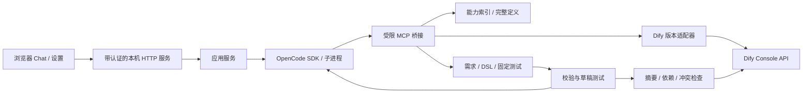

# 架构

[English](architecture.md) | [简体中文](architecture.zh-CN.md)

本地 Node.js 服务负责文件、凭据和任务生命周期；OpenCode 负责模型调用、上下文与工具执行。应用约束测试基线、预算和发布条件，不再另写一套通用规划器。

## 模块

| 路径                                          | 职责                                                 |
| --------------------------------------------- | ---------------------------------------------------- |
| `src/web/cli.ts`、`runtime.ts`                | 命令行参数、打开浏览器、退出清理、原生运行时定位     |
| `src/web/server.ts`、`page.ts`、`browser.ts`  | HTTP／SSE 认证、浏览器通信、目录选择、文件审查与确认 |
| `src/app/service.ts`、`host.ts`               | 连接、能力同步、继续对话、任务执行                   |
| `src/app/storage.ts`                          | 私有 JSON 原子写入、系统原生凭据存储                 |
| `src/ui/`                                     | Chat 时间线、设置表单、输入校验、固定命令列表        |
| `src/engine/opencode.ts`                      | CLI／SDK 1.18.34、独立服务、事件、恢复和取消         |
| `src/engine/bridge.ts`                        | 本机 MCP、随机 Bearer、拒绝浏览器来源、限定操作      |
| `src/dify/transport.ts`                       | Cookie、CSRF、会话保存、401 后一次刷新、反向代理路径 |
| `src/dify/capabilities.ts`                    | 工具身份、参数白名单、分页、状态、完整定义           |
| `src/dify/client.ts`、`sse.ts`、`versions.ts` | 版本契约、导入导出、草稿运行、SSE、取消与发布        |
| `src/core/controller.ts`                      | 固定测试、写操作意图、修复限制、摘要、覆盖冲突检查   |
| `src/core/validation.ts`、`node-templates.ts` | 原生 YAML、图和引用、参数与 Schema、版本节点结构     |
| `src/core/project.ts`、`chat.ts`、`types.ts`  | 项目文件、私有记录、公共契约                         |
| `src/core/i18n.ts`                            | 中英文消息和语言选择                                 |

## GitHub npm 分发

包只有一个入口 `aladdin-dify`，编译后的文件提交在 `dist/` 中。不使用名为 `build`、`prepare`、`prepack` 的脚本或安装生命周期脚本。npm 的 Git 获取器会因这些脚本安装临时开发依赖；避开它们后，用户可以直接运行编译程序。开发者使用 `npm run compile`，`npm run package` 明确执行编译和打包。CI 检查提交的编译文件是否与源码一致。

固定版本的可选依赖 `opencode-ai` 安装对应平台的官方原生包。CLI 直接定位该包，所以禁用 npm 安装脚本也能运行。省略可选依赖时会明确报告运行时缺失，不在任务期间随意下载执行文件，也不隐式使用全局 CLI。

## 本机 HTTP 边界

服务只监听 `127.0.0.1`。随机启动凭证五分钟内有效，使用一次后换成按端口区分的 HttpOnly／SameSite=Strict Cookie，并重定向清除地址栏中的凭证。页面、静态文件、状态、SSE 和 API 都需要会话。校验 Host 限制 DNS 重绑定，写操作必须来自本服务并提交 JSON。不开启 CORS；请求体、文件预览和 SSE 背压都有限制。

Nonce CSP 只允许打包的脚本和样式，不嵌入任意网页或框架。Markdown 子集和文件预览使用文本节点，不执行模型生成的 HTML。命令白名单和 Zod 表单不提供任意终端、文件操作。目录浏览和选择需要明确的已认证操作；文件预览按真实路径限制在当前项目或私有存储内。

浏览器只获得公开配置和“凭据是否已保存”标记。密码和 Key 草稿留在页面内存，保存后清空；聊天草稿写入 sessionStorage，但不包含凭据。语言切换重载页面，默认跟随浏览器，也可持久保存英文／简体中文偏好。用户和模型内容保留原语言。

确认操作使用一次性 ID，十分钟超时。覆盖原应用前在对话框展示 DSL 对比和报告。拒绝、超时、服务关闭都会按拒绝处理。SIGINT／SIGTERM 关闭应用服务，停止已知 Dify 运行和引擎，保存聊天记录并关闭 HTTP 流。结果未知的远端写操作仍需要核对。

## 存储与项目生命周期

`ApplicationHost` 将界面和存储操作与交付服务分开。JSON 使用原子写入和私有目录／文件权限。密码、Key、Cookie 和 Token 写入原生 `@napi-rs/keyring`，凭据命名空间按数据目录摘要区分，不提供明文回退。Linux Secret Service／内核存储的可用性和持久性取决于用户环境。

私有目录默认为 `~/.aladdin-dify`；项目保存需求、DSL 和测试。项目设置、能力、运行和聊天按项目真实路径、实例／账号和工作空间隔离。同一时间只运行一个修改任务；任务或设置变更期间不能切换项目。需求文件由聊天输入自动创建，不要求手工填写 Markdown。

`sendChat` 的第一条消息创建任务，继续对话沿用 OpenCode 会话、原应用／测试应用映射和测试基线；修复轮次重置，用量累计。`ChatJournal` 按会话／消息片段 ID 合并事件和最终回复，过滤内部提示和推理，仅保留限定工具信息。新对话归档旧记录，不删除项目文件，暂时没有历史浏览页面。

## Dify 认证与版本

适配器面向 1.14.2／DSL 0.6.0 和 1.17.1／DSL 0.7.0。其他版本需要单独契约和测试。两个版本的登录接口均按源码使用 Base64 编码 UTF-8 密码；这不是加密，传输保护依赖 HTTPS。控制台使用 Cookie 和 `X-CSRF-Token`，应用 Service API Key 不授予编辑权限。

401 后只刷新一次会话，网络错误不自动重放写操作。导入、发布和覆盖前保存写操作意图，恢复时查询远端状态；无法确定结果时要求处理。原应用更新提交服务端 Hash，客户端完成对比后再次发生的修改仍可被拒绝。

1.14.2 要求完整 `environment_variables`，通过原秘密变量 ID 和源码定义的掩码保留已有值；1.17.1 使用不包含秘密值的 `environment_variable_patch`。测试副本无法从导出中取得秘密值，可能需要在 Dify 另行配置。暂不支持的秘密节点合并会阻止覆盖。

## 工具可见性与评测

索引覆盖内置／插件、API、工作流和 Dify 已接入的 MCP 工具。身份为 `[kind, providerId, toolName]`，不按显示名称匹配。完整定义保留必填项、默认值、枚举、表单、嵌套 JSON Schema、输出和插件引用，不编造未知输出或缺失动态选项。发现字段通过白名单排除凭据；工具描述属于外部数据，不是应用指令。

桥接提供项目操作、能力详情、版本规则、校验、导入、测试和受约束的发布。业务工具由 Dify 使用自身凭据执行，Agent 没有任意终端或直接覆盖原应用的工具。已用能力变化后，即使 YAML 仍能解析，也会使旧测试证据失效。

控制器固定首个候选版本的测试基线，把失败证据返回同一引擎会话，默认最多修复五轮。候选未变且同一错误连续两轮出现时停止重试。Workflow 用例独立执行；Chatflow 每轮修复后重建各用例的独立对话。SSE 必须到达 `workflow_finished`，Chatflow 成功还要求 `message_end`。YAML、导入或 HTTP 200 不能替代业务断言，尚未实现 LLM-as-judge。

Dify 测试应用不能隔离外部业务写操作，也没有跨系统回滚。仍需授权测试范围、测试环境、幂等控制和人工核对。静态或节点夹具测试不能证明真实兼容，验证情况见兼容矩阵与业务验收清单。
