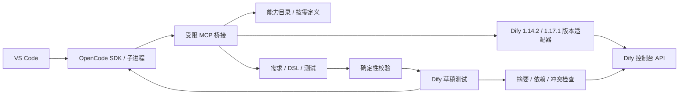

# 架构与扩展接口

[English](architecture.md) · [简体中文](architecture.zh-CN.md)

VS Code 管理目录、安全配置和任务生命周期；OpenCode 管理模型、上下文与工具调用。宿主监督器执行固定测试、预算和发布约束，不另写通用规划器。

## 模块

| 路径                              | 职责                                                           |
| --------------------------------- | -------------------------------------------------------------- |
| `src/extension.ts`, `src/ui/`     | 设置页、聊天交互、校验、命令和差异确认                         |
| `src/engine/opencode.ts`          | 固定 CLI/SDK 版本、独立服务、流式事件、会话恢复和取消          |
| `src/engine/bridge.ts`            | 仅绑定 127.0.0.1、随机 Bearer、拒绝浏览器 Origin、MCP 读写边界 |
| `src/dify/transport.ts`           | Cookie、CSRF、会话持久化、一次 401 刷新、反向代理路径          |
| `src/dify/capabilities.ts`        | 工具身份、参数白名单、分页、状态、按需详细查询                 |
| `src/dify/client.ts`, `sse.ts`    | 控制台导入/导出、草稿运行、SSE、停止、发布                     |
| `src/core/controller.ts`          | 冻结基线、导入意图、修复上限、摘要门禁、原应用冲突与恢复       |
| `src/core/validation.ts`          | YAML、图、引用、参数、Ajv 嵌套 schema、依赖校验                |
| `src/core/node-templates.ts`      | 固定上游源码派生的节点结构骨架；不是已验证节点认证             |
| `src/core/project.ts`, `types.ts` | 项目与私有存储、公共数据契约                                   |

## 设置页与任务面板

`SettingsPanel` 提供单例编辑器设置页，首次激活自动显示；`Sidebar` 提供底部聊天输入框和对话时间线，展示需求、Agent 回复、工具调用、任务阶段和结果，默认放在右侧 Secondary Side Bar。任务容器为 `aladdinDifyRight`，视图为 `aladdinDify.taskPanel`；这组新 ID 避免旧版左侧布局的缓存干扰。启动完成后自动聚焦视图，收起后可从底部 Dify 按钮或命令恢复，设置页可关闭自动显示。默认位置使用 [VS Code 1.106 的稳定贡献接口](https://code.visualstudio.com/updates/v1_106#_view-containers-in-secondary-side-bar)。两者共用编译后的浏览器脚本，通过固定命令白名单通信。宿主使用 Zod 验证消息及任务选项并执行真实连接、能力发现和任务控制，不把 API 调用逻辑放在 Webview 内。

Webview 使用 nonce CSP 和扩展资源范围限制。宿主只返回公开配置与“凭据已保存”布尔状态，不返回密码、Cookie、API Key 或凭据引用。需求草稿可保存在 Webview 状态；设置草稿中的密码和密钥只留在当前页面内存，不进入 Webview 持久化。更换供应商或地址后不能自动沿用旧地址的密钥。

设置可以在未打开目录时完成。保存任务时自动建立项目并将需求和验收写入 `dify.project.json` 与 `requirements.md`，Agent 读取合并后的要求。用户无需编辑这些文件才能开始任务。与外部数据有关的测试授权、原应用差异确认和冲突检查仍由宿主执行。

聊天消息通过 `sendChat` 进入同一任务控制器；首次消息保存需求并启动，后续消息恢复同一 OpenCode 会话和测试应用。`ChatJournal` 以 session / part ID 合并流式事件和最终响应，过滤内部用户提示词及 reasoning，工具卡片只保留名称、状态、标题或错误。当前对话在扩展私有文件内原子保存，输入草稿保存在 Webview 状态；新对话归档旧记录，不删除业务文件。后续修改保留冻结测试与目标，重新计算修复轮次，累计 Token 预算继续生效。Webview 完成实际 DOM 初始化后才报告就绪。

界面默认跟随 VS Code，支持英文和简体中文，也可在设置页手动选择。切换会重新加载设置与聊天页面，并清空尚未保存的密码、密钥输入。用户消息、Agent 回复、项目名称、工具定义和外部错误保留原语言；命令面板跟随 VS Code 的显示语言。

## 认证与版本

已实现 1.14.2 / 1.17.1 的版本契约；DSL、原应用环境变量更新和 Agent 规则按连接版本选择。其他版本需要新增适配并扩展兼容测试，不能仅放宽版本输入框后宣称兼容。`ConnectionProfile` 不含密码。登录按两个固定版本源码将 UTF-8 密码做 Base64 编码；这不是加密，传输保护由 HTTPS 提供。接口使用 Cookie 与 `X-CSRF-Token`，不使用旧控制台 Bearer 登录假设。

401 刷新最多一次；网络故障不自动重放写操作。`pendingImportDigest`、`pendingPublishDigest`、`pendingPromotion` 在写入前持久化。恢复会先核对远端；不能明确确定结果时进入需要处理状态。原应用更新未知时不再次写入；需在 Dify 核对草稿与发布状态。原应用更新调用草稿接口并提交服务器 hash，在最后一次并发检查后发生的新变更也由服务端拒绝。环境变量按版本使用增量 patch 或原 ID + 官方秘密掩码，秘密值不进入请求，原值保留。

## 工具可见性

索引覆盖当前工作空间四类工具。唯一键是 `[kind, providerId, toolName]`，显示名称不参与身份判断。完整定义由 Dify 控制台读取，保留必填性、默认值、选项、表单类型、复杂 JSON schema、输出 schema 和插件引用。未知输出保持未知；Dify 本身未公开的约束不能推测。动态选项未返回时阻断猜测取值。

认证字段通过白名单排除。工具描述是外部数据，不是插件策略；MCP 无终端、任意文件读写或原应用覆盖工具。工具详情更新时即使 YAML 仍通过静态校验，也会因环境摘要变化要求重测。

## 任务与测试

首次 Agent 输出候选和用例后，宿主冻结用例摘要。每轮将真实失败节点、输出和断言反馈至同一 OpenCode 会话。最多初次生成加 5 次修复；相同错误和候选连续两轮不变则停止。

Workflow 每个案例一次独立草稿运行；Chatflow 每个案例独立 conversation，每次修复重新开始。最终轮必须通过案例断言，不能用单轮断言替代总体验收。SSE 必须有 workflow_finished；成功 Chatflow 还需 message_end。HTTP 200、导入成功和 YAML 解析均不能单独证明业务成功。

测试本身可能执行外部写操作；测试应用仅隔离 Dify 应用定义。发生未知结果的业务写操作不能保证幂等，用户应使用业务工具自己的测试环境、幂等键或人工核对后再恢复。首版没有跨外部系统的事务回滚。

## 已知限制

静态校验不覆盖 Dify 的全部运行时语义，真实导入和执行仍是必须门槛。节点骨架来自上游，尚未逐节点通过真实服务。Secret 环境变量的值不从原应用导出，因此需要在测试副本中另行配置；更新原应用时保留原值。节点秘密配置尚不能安全自动合并，会阻断覆盖。缺失凭据不能通过修改 DSL 自动修复。升级 OpenCode 或 Dify 必须重新执行接口、原生引擎及实际业务验收。

1.14.2 的草稿接口要求发送完整 `environment_variables`；旧秘密变量只发送原 ID 和 20 个星号的官方掩码，由服务端 `normalize_environment_variable_mappings` / setter 保留原值。1.17.1 使用 `environment_variable_patch`，省略秘密值。两者都提交远端 hash，避免覆盖并发修改。
